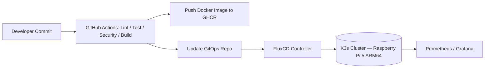
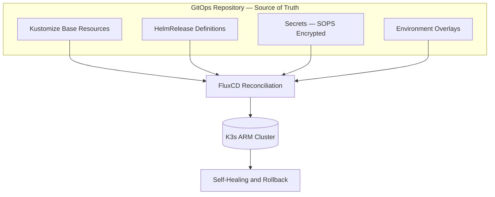

<!-- TODO(human): Write your opening hook here. 3–5 sentences. Who are you, why did you build this, and why does it matter to you personally? This is the first thing a hiring manager or recruiter will read. -->

---

## The Problem: Configuration Drift at Scale

When I started this project, I wasn't trying to deploy a random Kubernetes cluster on Raspberry Pis. I was trying to solve a real platform reliability problem that mirrors what production teams face in modern SaaS environments: **configuration drift and operational inconsistency across nodes.**

I had a **3-node Kubernetes cluster running on Raspberry Pi 5 hardware** (ARM64, 16GB RAM per node, Ubuntu 22.04, K3s v1.29). Each node was backed by fast NVMe SSD storage, but despite the solid hardware, the cluster was slowly becoming unstable over time due to one critical issue: **I was deploying workloads manually using `kubectl apply`** directly on the nodes.

At first, this seemed manageable. But within days, I ran into a recurring problem: **each node was slightly different.** One had an outdated ConfigMap. Another had a missing secret. A third had an older container image tag because I forgot to apply the latest manifest. I had unintentionally created **three unique snowflake clusters** operating under the illusion of being one.

### Technical Constraints

What made this even more challenging was my environment:

- **No Load Balancer:** NodePort only — no MetalLB, no external controller.
- **ARM Architecture:** Many container images were not multi-arch, and some dependencies weren't fully supported on ARM.
- **Self-Managed GHCR Authentication:** GitHub Container Registry required authentication for private image pulls — something Kubernetes wouldn't do without correct `imagePullSecrets`.
- **Limited Tooling:** No cloud control plane. No managed storage classes. Everything from DNS to reconciliation had to be implemented manually.
- **Knowledge Gaps:** I knew the theory of GitOps, but I had never implemented FluxCD reconciliation or Kustomize overlays in a real multi-node cluster.

**This was no longer a deployment experiment — it was a reliability engineering challenge.** I needed a system that would guarantee state consistency, automated reconciliation, version control of infrastructure, and built-in auditability.

That's when I made the decision: **I would convert the entire platform to a GitOps model using FluxCD.** I didn't realize it yet, but this decision would lead me through multiple failures before achieving stability.

---

## Initial Approach and First Failure

Before committing to GitOps, I took the approach most engineers take when learning Kubernetes: **I deployed everything manually.** YAML manifests sat in a local folder on my laptop. Whenever I made a change — like updating an environment variable or modifying a Deployment — I would run:

```bash
kubectl apply -f deployment.yaml
```

This approach worked until it didn't.

There was no audit trail. No clear versioning. And worst of all, **when something broke, I had no single source of truth to revert to.** Every node in the cluster could end up in a different state depending on which manifests I had last applied. This is when I realized I wasn't managing a Kubernetes platform — I was babysitting it.

### Bootstrapping FluxCD

To fix drift and enforce a declarative model, I decided to use **FluxCD**. The promise was clear: store Kubernetes manifests in Git, and the cluster automatically reconciles itself to match whatever is committed. No drift. No manual intervention.

On Day 3, I ran the Flux bootstrap command:

```bash
flux bootstrap github \
  --owner=bmacharia \
  --repository=pi-cluster \
  --branch=main \
  --path=./clusters/staging \
  --personal
```

Within 30 seconds, my cluster entered chaos.

### The Failure

Pods began crashing in a loop. The `flux-system` namespace showed repeated reconciliation errors:

```
Failed to pull image "ghcr.io/bmacharia/linkding:latest": 
rpc error: code = Unknown desc = failed to authorize: 
failed to fetch anonymous token: unexpected status: 401 Unauthorized
```

At first, I assumed the issue was RBAC misconfiguration. I spent an hour reviewing ClusterRoleBindings and even recreated the Flux service account.

Nothing changed.

That's when it hit me: **Flux was trying to pull private images from GitHub Container Registry (GHCR), but I had not configured an `imagePullSecret`.** In my manual workflow, I had run `docker login` once on the cluster and forgot that Kubernetes itself has no knowledge of my local Docker auth context.

**What I learned:**

- Manual auth does not transfer to Kubernetes workloads
- When using GitOps, *every configuration must be declared in Git — including secrets*
- GitOps isn't just a deployment mechanism; it's an **operational discipline**

---

## Iteration Cycles: The Real Engineering Work

This is where the real engineering began. I went through three major iteration cycles — each driven by a failure that forced me to rethink my mental model of GitOps, FluxCD, and Kubernetes platform design.

### Iteration 1 — YAML to Kustomize (and Breaking My First Helm Deployment)

After fixing the registry authentication issue by adding an `imagePullSecret` into Git, I realized I needed a structured way to manage multiple environments. I introduced **Kustomize overlays**, using a folder structure like:

```
clusters/
  staging/
    kustomization.yaml
    linkding/
      deployment.yaml
      kustomization.yaml
```

My goal was to separate base resources from environment-specific patches. But when I enabled this structure, my **HelmRelease objects failed to reconcile**.

**Root Cause:** FluxCD applies manifests in dependency order. My base resources depended on CRDs managed by Helm, but because the overlays were layered incorrectly, Flux tried to apply resources *before* the Helm controller was ready.

**Breakthrough:** I realized that GitOps isn't just "put YAML in Git." It's about defining the *correct dependency graph.* I modified my Flux Kustomization to include `dependsOn`:

```yaml
dependsOn:
  - name: flux-system
```

This was my first exposure to the reality that **GitOps is closer to Terraform than kubectl.** Ordering matters. Dependencies must be explicit.

**Result:** Deployment succeeded — but consistency was still not guaranteed across namespaces.

---

### Iteration 2 — Introducing SOPS (And Breaking My Cluster Again)

My next goal was to secure secrets. I chose **Mozilla SOPS with age encryption**, integrated with Flux so that secrets would be decrypted *inside* the cluster at reconciliation time.

I encrypted my first secret, committed it to Git, and waited.

Then everything failed.

```
failed to decrypt: missing key for decryption
```

SOPS was working fine locally, but Flux could not decrypt because I encrypted the wrong field (`data` instead of `stringData`). Flux ignores improperly structured encryption.

**Breakthrough:** I learned that **Flux decrypts only well-structured SOPS documents** and does so only at reconciliation — never locally. The encryption must precisely follow Kubernetes schema.

**Result:** Once corrected, secrets were decrypted reliably. This was the first time I had true GitOps control over sensitive data.

> **Lesson:** Secret management is not a bolt-on feature. It's foundational to GitOps.

---

### Iteration 3 — Image Automation Loops (The Reconciliation Race Condition)

With deployments and secrets working, I enabled **Flux Image Automation** to automatically update manifests based on the latest image tags in GHCR.

Within seconds, my cluster entered an infinite reconciliation loop.

**Symptom:** Every time a new image was built, Flux would update the Git manifest, commit the change, then immediately reconcile again — triggering another commit. Constant rollouts. Endless commit noise.

**Root Cause:** I had enabled automatic image updates before establishing reconciliation stability. The automation controller was faster than the reconciliation loop, resulting in a runaway feedback cycle.

**Resolution:** I disabled automation temporarily and switched to **semantic version tagging**. I configured Flux to watch for `vX.Y.Z` only — no `latest` or dev tags.

**Result:** Stable, predictable deployments based solely on Git commits.

---

### Iteration Summary

Each cycle forced a mindset shift:

| Iteration | Lesson |
|---|---|
| 1 — Kustomize | GitOps is not "deploy from Git" — it's dependency management |
| 2 — SOPS | Secret encryption is part of the deployment graph |
| 3 — Image Automation | Automation must follow stability, not precede it |

At this point, I had a platform that reconciled continuously, rolled back on failure, and reflected any change in Git to the cluster within 60 seconds.

---

## How I Used LLMs (And Where I Overrode Them)

I used an LLM (ChatGPT) throughout this project — not as an answer engine, but as a *thinking partner*. I learned very quickly that LLMs can accelerate discovery, but only if you treat them like pair engineers, not oracles.

During the GHCR authentication failure, I asked:

```
How do I configure FluxCD to authenticate with GitHub Container Registry on a K3s cluster 
using a personal access token, running on ARM architecture?
```

The response recommended creating a Kubernetes secret using an imperative command:

```bash
kubectl create secret docker-registry ghcr-secret \
  --docker-server=ghcr.io \
  --docker-username=USERNAME \
  --docker-password=TOKEN \
  --namespace=default
```

This was technically correct — but **operationally wrong** for a GitOps model. Imperative actions cause configuration drift because they are not committed to Git.

Instead, I created a declarative secret in YAML, encrypted it with SOPS, and committed the file to Git:

```yaml
apiVersion: v1
kind: Secret
metadata:
  name: ghcr-secret
  namespace: flux-system
type: kubernetes.io/dockerconfigjson
stringData:
  .dockerconfigjson: |
    { "auths": { "ghcr.io": { "auth": "<base64-token>" } } }
```

**Key takeaway:** LLMs are invaluable for explaining obscure error messages and comparing architecture options. But they are *not* a replacement for architectural judgment. **The power of LLMs comes from how you challenge and refine their suggestions** — not in how quickly you accept them.

---

## Retrospective: What I'd Do Differently

### 1. Design the GitOps Directory Structure First

My biggest early mistake was treating Git as a dumping ground for manifests instead of treating it as the *control plane*. The Git structure **is the architecture**. It should be designed upfront, not evolved reactively.

### 2. Use OIDC Instead of a Personal Access Token

I initially used a long-lived PAT for GHCR authentication. This introduced security debt and required secret rotation. Flux supports GitHub OIDC with short-lived tokens — a more production-ready model from day one.

### 3. Introduce Observability Earlier

I tried to troubleshoot Flux using `kubectl logs` alone. This delayed my understanding of reconciliation loops and health checks. Once I deployed Prometheus and Grafana, issues became immediately visible. **Observability is not a "nice to have" — it's part of deployment infrastructure.**

### 4. Plan for ARM Compatibility at the CI Stage

Several containers I pulled were not multi-architecture. If I had enabled multi-arch builds from the beginning using `docker buildx` and GitHub Actions, I would have saved hours.

### 5. Treat Automation as a Phase 2 Concern

Enabling Flux image automation too early caused instability. **Stability before speed.**

---

## Architecture

### End-to-End GitOps Flow



### GitOps Dependency Graph



---

## Closing Thought

This project wasn't just about building a Kubernetes platform — it was about developing **production thinking**. Every failure reinforced a core truth:

> **DevOps is not the practice of deploying faster. It is the practice of deploying with certainty.**

The tools — FluxCD, Kustomize, SOPS, Prometheus — are secondary. The primary skill is learning to treat your infrastructure as a system that must be *reasoned about*, not just operated.

---

*Tech stack: K3s · FluxCD · Kustomize · SOPS · age · GitHub Actions · GHCR · Prometheus · Grafana · Terraform · Raspberry Pi 5 (ARM64)*
